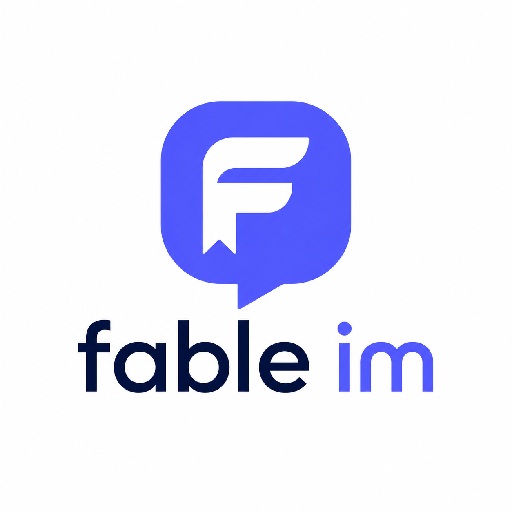

# Fable Chat

  

这是一个按四个 MVP 阶段“生长出来”的 KamaChat 复刻与扩展项目。目录层次、主要模型、接口分层和前端页面尽量保持与 KamaChat 一致，再通过 AI/MCP、可靠性和分布式能力形成自己的增量。

## 学习约定

- 核心业务代码由项目作者手写，不由 AI 直接生成。
- Copilot 可以用于补全单个函数，但使用者必须能逐行解释并自行修改。
- 每个 MVP 必须先通过验收，再进入下一阶段。
- 新技术必须用于解决上一阶段已经观察到的问题。
- 每个关键设计都记录“为什么这样做”和“放弃了什么方案”。
- 项目初始化、目录创建、`go mod init`、前端脚手架和每个源码文件都由项目作者亲手完成。
- 参考 KamaChat 的业务边界、命名和代码组织，但不直接复制长段实现。
- 每次只查看当前 MVP 对应的 KamaChat 文件，避免提前看到完整答案。

## 四阶段路线

| 阶段 | 核心能力 | 主要技术 | 阶段矛盾 |
|---|---|---|---|
| MVP0 | 用户、会话、可靠单聊 | Go、Gin、GORM、MySQL、WebSocket | 单机可以聊天，但多人业务和热点查询开始复杂 |
| MVP1 | 联系人、群聊、缓存与在线状态 | Redis、心跳、群成员模型 | 单机功能完整，但缺少 AI 能力且无法跨实例投递 |
| MVP2 | 群聊 AI 助手与自研 MCP Server | LLM、MCP、异步任务、权限审计 | AI 能使用聊天数据，但聊天服务仍是单实例 |
| MVP3 | 音视频与分布式聊天 | WebRTC、Kafka、Redis 路由、K8s | 完成跨实例投递、实时通话和部署演示 |

详细文档：

- [总路线与验收规则](docs/roadmap.md)
- [MVP0：用户与可靠单聊](docs/mvp0-core-chat.md)
- [MVP1：联系人、群聊与 Redis](docs/mvp1-group-redis.md)
- [MVP2：AI 助手与 MCP](docs/mvp2-ai-mcp.md)
- [MVP3：音视频、Kafka 与 K8s](docs/mvp3-realtime-distributed.md)
- [KamaChat 参考映射](docs/kamachat-reference.md)
- [开发问题记录](docs/development-log.md)

## 当前仓库边界

当前只保存需求与学习文档，不预先创建任何项目结构。后续目录应参考 KamaChat，由你按照 MVP0 文档从空仓库亲手建立。

## 当前起点

先阅读 [KamaChat 参考映射](docs/kamachat-reference.md) 的 MVP0 部分，再亲手完成 `go mod init`、目录建立和第一个入口文件。不要提前创建 MVP1—MVP3 的包和目录。

## License

Fable Chat 的自有代码采用 [MIT License](LICENSE) 开源。

`ZChat/` 是仓库内保留的第三方参考项目，不属于 Fable Chat 的 MIT 授权范围，继续遵循其目录中的 [GPL-3.0 License](ZChat/LICENSE)。
