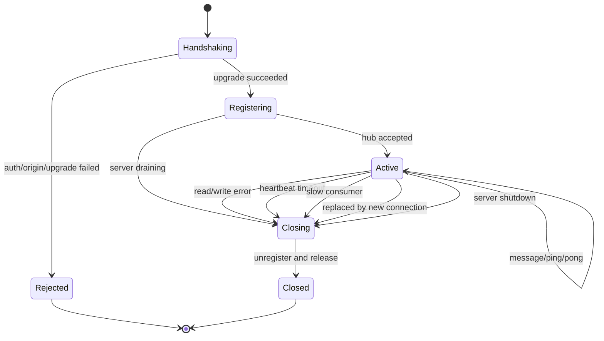

# WebSocket 完整生命周期设计与实现任务

## 1. 文档目标

本文用于指导 Fable 当前单机单聊 WebSocket 的重构。本文只规定：

- 完整生命周期包含哪些阶段；
- 当前实现存在什么问题；
- 目标文件结构；
- 每个类型和函数的建议签名、职责与调用关系；
- 可以参考 ZChat 的具体位置，以及哪些设计不能照搬；
- 单元测试和联合测试必须覆盖哪些行为。

本文不包含函数实现代码。

本阶段只实现单机、单进程、单用户单活连接。Redis、多实例路由、多设备同时在线、群聊和音视频信令不属于本次任务，但设计需要为后续扩展保留边界。

---

## 2. 什么是完整的 WebSocket 生命周期

WebSocket 生命周期不只是“升级 HTTP，然后启动两个 goroutine”。完整生命周期是从服务启动、连接建立，到连接退出和服务停机的整个闭环。

### 2.1 服务启动

服务启动时应完成：

1. 创建唯一的 `Hub` 实例；
2. 启动 `Hub.Run` 事件循环；
3. 创建消息服务；
4. 将 `Hub` 和消息服务注入 WebSocket Handler；
5. 启动 HTTP Server；
6. 准备接收操作系统退出信号。

`Hub` 是本进程中在线连接的唯一所有者。Controller、Client 和消息服务不应各自维护在线用户 Map。

### 2.2 HTTP 握手与身份认证

客户端首先发起普通 HTTP 请求。服务端必须在协议升级之前完成：

1. 解析并验证 JWT；
2. 从 JWT 得到 `user_uuid`；
3. 校验 Origin；
4. 检查服务是否正在停机；
5. 调用 WebSocket Upgrade。

身份必须来自服务端验证过的 Token，不能由请求体中的 `send_id` 决定。

如果认证、Origin 或参数检查失败，必须返回普通 HTTP 错误，不能先 Upgrade 再尝试返回 JSON。

### 2.3 创建连接对象

Upgrade 成功后创建 `Client`。一个 `Client` 代表一个具体 WebSocket 连接，而不是抽象的用户。

它至少具有：

- `connectionID`：区分同一用户先后建立的连接；
- `userUUID`：连接所属用户；
- `conn`：底层 Gorilla WebSocket 连接；
- `send`：有界的服务端出站队列；
- `done`：连接结束信号；
- `closeOnce`：保证关闭操作只执行一次；
- `hub` 和 `messageService`：连接需要调用的依赖。

### 2.4 注册与重复连接处理

Client 创建后向 Hub 注册。

本阶段采用“同一用户只保留最新连接”的策略：

- 用户第一次连接：直接登记；
- 同一用户再次连接：新连接替换旧连接；
- Hub 通知旧连接以正常的 Close Frame 退出；
- 旧连接随后发出的注销请求不能误删新连接。

因此注销操作必须比较 `connectionID` 或 Client 指针，不能只执行 `delete(clients, userUUID)`。

### 2.5 稳态运行：一个读协程和一个写协程

每个 Client 运行两个 Pump：

- `readPump` 是这个连接唯一的读取者；
- `writePump` 是这个连接唯一的写入者。

Gorilla WebSocket 允许一个并发 reader 和一个并发 writer。业务代码、Hub 和 Controller 都不能绕过 `writePump` 直接向同一个连接写消息。

### 2.6 入站消息路径

客户端发消息时，完整路径是：

1. `readPump` 读取一个 Frame；
2. 限制 Frame 大小并解析协议 Envelope；
3. 校验事件类型、`request_id`、`session_uuid` 和正文；
4. Sender 只取当前 Client 的 `userUUID`；
5. 消息服务根据 `session_uuid` 查询会话并验证 Sender 是会话成员；
6. 服务端从会话计算 Receiver，不能信任客户端提供的 `receive_id`；
7. 消息成功写入 MySQL；
8. 向 Sender 的出站队列写入服务端确认；
9. 如果 Receiver 在线，向 Receiver 的出站队列发布消息；
10. 如果 Receiver 不在线，消息仍然保留在 MySQL，发送流程仍算成功。

数据库写入失败时不能进行在线推送，也不能向 Sender 返回成功确认。

### 2.7 出站消息路径与背压

所有发往客户端的数据都先进入该 Client 的有界 `send` 队列，然后由 `writePump` 串行写入连接。

有界队列用于防止慢客户端无限占用内存。队列已满时，本阶段采用明确的慢客户端策略：

1. Hub 不阻塞其他用户的发布；
2. 标记该 Client 为慢客户端；
3. 关闭该连接；
4. 客户端通过重连和历史消息接口恢复数据。

不能在持有 Hub 锁时向 Client Channel 阻塞发送。

### 2.8 心跳、超时与半开连接

仅依赖 `ReadJSON` 返回错误无法及时发现断网、NAT 映射失效或客户端进程冻结。

完整连接需要：

- 设置最大读消息大小；
- 设置初始读截止时间；
- 收到 Pong 时延长读截止时间；
- `writePump` 定时发送 Ping；
- 每次写消息设置写截止时间；
- 超过 Pong 等待时间后由 `readPump` 退出。

浏览器会自动回复 WebSocket Ping。应用层不需要额外设计 JSON 心跳消息。

### 2.9 连接结束与统一清理

以下任一情况都可能结束连接：

- 客户端发送 Close Frame；
- 读取失败；
- 写入失败；
- 心跳超时；
- 消息格式或权限错误达到关闭条件；
- 出站队列满；
- 同账号新连接替换旧连接；
- 服务端优雅停机。

无论由哪个原因触发，都必须进入同一套清理流程：

1. 只触发一次关闭；
2. Hub 按连接身份注销 Client；
3. 停止 Ping ticker；
4. 停止读写 Pump；
5. 尽力发送 Close Frame；
6. 关闭底层连接；
7. 释放 Channel 和 goroutine；
8. 记录结构化的断开原因。

不能让 `readPump` 和 `writePump` 分别执行一套互相竞争的 Map 删除、Channel 关闭和连接关闭逻辑。

### 2.10 服务端优雅停机

收到退出信号后：

1. HTTP Server 停止接受新请求和新 WebSocket 握手；
2. Hub 进入关闭状态，不再接受注册和发布；
3. Hub 向全部活跃 Client 发出服务重启 Close Frame；
4. 等待 Client Pump 在截止时间内退出；
5. 超时后强制关闭剩余连接；
6. 最后关闭数据库等基础资源。

`http.Server.Shutdown` 不负责关闭已经 Hijack 的 WebSocket 连接，所以 Hub 必须显式管理这些连接。

### 2.11 生命周期状态图



---

## 3. 当前写法的缺陷

### 3.1 全局状态没有明确所有者

位置：`internal/service/chatservice/ws.go`

当前 `onlineUsers` 和 `mu` 是包级全局变量：

- 服务启动和停止时没有创建、运行、关闭的过程；
- 测试只能临时替换全局 Map，测试之间容易互相污染；
- 后续 MCP、Redis 或多实例接入时，很难注入相同的连接管理器；
- Controller 隐式依赖全局变量，不利于联合测试。

目标：由 `main.go` 创建唯一 Hub，并显式注入 HTTP、WebSocket 和后续 MCP 发送工具。

### 3.2 Map 存在并发读写风险

位置：`internal/service/chatservice/ws.go` 的 `ReadPump` 和 `WritePump`

注册、删除时使用了锁，但以下访问没有锁：

- `onlineUsers[msg.ReceiveId]`；
- `onlineUsers[userUUID]`。

这可能造成 Go 的 concurrent map read and map write panic。

目标：只有 Hub 事件循环拥有和修改 Clients Map，其他组件通过 Hub 方法交互。

### 3.3 给离线用户发送会 panic

位置：`ReadPump` 中向 `onlineUsers[msg.ReceiveId].ch` 发送的位置。

Receiver 不在线时 Map 返回 `nil`，访问 `.ch` 会发生 nil pointer panic。

目标：`Publish` 明确返回“在线且入队成功”“不在线”“队列已满”等结果。用户离线不是错误，数据库中的消息仍然有效。

### 3.4 无缓冲 Channel 会阻塞整个消息处理

位置：`RegisterUser` 创建 `ch` 的位置。

当前 Channel 没有缓冲。Receiver 写协程稍慢、已经退出或调度不及时，Sender 的 `ReadPump` 就会一直阻塞。

目标：使用有界缓冲队列，并规定队列满时关闭慢客户端，不能无限等待。

### 3.5 重复连接会导致新连接被旧连接误删

位置：`RegisterUser` 和两个 Pump 的 defer。

当前新连接会直接覆盖旧 Client，但没有关闭旧连接。旧连接稍后退出时执行 `delete(onlineUsers, userUUID)`，会把刚注册的新 Client 删除。

目标：Client 必须带 `connectionID`；替换时关闭旧 Client；注销时只删除当前仍与该连接匹配的记录。

### 3.6 关闭逻辑重复且会竞争

位置：`ReadPump` 和 `WritePump` 的 defer。

两个 Pump 都删除 Map 并关闭同一个连接：

- 关闭原因不统一；
- 清理可能执行两次；
- 没有通知另一个 Pump 退出；
- Channel 没有安全关闭策略；
- 容易残留阻塞 goroutine。

目标：Client 使用统一 `Close`，通过 `sync.Once` 保证只触发一次；Hub 统一注销。

### 3.7 `WritePump` 在 Map 中反复查找自己

位置：`WritePump`。

Client 注册后，Pump 应直接持有自己的出站 Channel。当前每轮从全局 Map 查找会受到替换和删除影响；删除后可能 panic，替换后甚至可能读取另一个连接的 Channel。

目标：`Client.writePump` 只读取 `c.send`。

### 3.8 身份字段和认证流程不统一

位置：`internal/https_server/auth_middleware.go`、`internal/api/v1/ws_controller.go`。

当前中间件同时写入 `user_uuid` 和兼容字段 `user_id`，Controller 仍读取 `user_id`。Controller 在取不到值时返回 JSON 却没有 `return`，随后的类型断言还可能 panic。

此外，Controller 在 Upgrade 之后才读取身份；此时再返回普通 JSON 已经没有正确的 HTTP 语义。

目标：统一只使用 `user_uuid`；身份验证和 Context 检查必须在 Upgrade 前完成。

### 3.9 Origin 校验完全放开

位置：`internal/api/v1/ws_controller.go` 中的 `CheckOrigin`。

始终返回 `true` 会允许任意网页源尝试建立连接。Token 如果通过 Cookie 或 URL 泄漏，会放大跨站 WebSocket 劫持风险。

目标：从配置读取允许的 Origin；开发环境也应列出明确地址，不使用无条件允许。

### 3.10 Query Token 有日志泄漏风险

位置：`WsAuth`。

浏览器原生 WebSocket API 不能自由设置 `Authorization` Header，因此 Query Token 在当前 MVP 中可以暂时兼容，但 URL 可能进入代理日志、浏览器历史或监控系统。

目标：本阶段保留兼容但禁止记录完整 URL；后续改为安全 Cookie 或短期、一次性的 WebSocket Ticket。

### 3.11 入站协议信任了不必要的客户端字段

位置：`internal/dto/wschat/chat.go`。

客户端提交 `send_id` 和 `receive_id`：

- `send_id` 应直接来自 Token；
- `receive_id` 应由服务端根据 `session_uuid` 计算；
- 当前消息没有 `request_id`，客户端无法关联确认或安全重试；
- 没有事件类型，后续无法自然增加 ACK、系统事件和信令。

目标：使用带 `type` 和 `request_id` 的 Envelope；发送消息只提交 `session_uuid` 和 `content`。

### 3.12 数据库错误被忽略

位置：`ReadPump` 中 `dao.GormDB.Create`。

当前没有检查创建消息是否成功。数据库写入失败后仍可能继续向 Receiver 推送一条实际上不存在的消息。

目标：消息持久化是在线发布的前置条件；失败时向 Sender 返回结构化错误，不发布给 Receiver。

### 3.13 没有服务端确认和幂等键

当前只向 Receiver 推送原始请求，Sender 收不到服务端生成的消息 UUID 和创建时间。网络断开后客户端无法判断是否已经入库，重试可能生成重复消息。

目标：客户端生成 `request_id`；服务端成功入库后返回包含 `message_uuid` 的确认。完整幂等约束可以作为消息服务的紧随任务，但协议必须现在预留 `request_id`。

### 3.14 没有心跳、超时和消息大小限制

当前连接可能永久占用资源，也可能接收超大消息导致内存压力。

目标：配置 `readLimit`、`pongWait`、`pingPeriod` 和 `writeWait`，由两个 Pump 统一使用。

### 3.15 没有优雅关闭

位置：`cmd/my_chat_server/main.go`。

当前使用 `log.Fatal(http.ListenAndServe(...))`，没有信号处理、HTTP Shutdown 和 WebSocket Client 清理。数据库的 defer 也会被 `log.Fatal` 触发的 `os.Exit` 跳过。

目标：使用可关闭的 `http.Server`；收到信号后依次停止新请求、关闭 Hub、等待 Pump、关闭数据库。

### 3.16 测试只覆盖理想路径

当前单元测试只检查注册和覆盖；联合测试主要检查两个在线用户互发消息和错误 `client_id`。

以下高风险行为没有测试：离线 Receiver、重复连接、断线清理、并发发布、慢客户端、数据库失败、非法消息、心跳超时、服务停机和 goroutine 退出。

---

## 4. 目标文件结构

```text
cmd/my_chat_server/
└── main.go                              # 创建 Hub、组装依赖、启动与优雅停机

internal/api/v1/
├── ws_controller.go                    # Handler 构造、握手检查、Upgrade、创建 Client
└── ws_controller_test.go               # Upgrade 前失败、Origin、身份传递

internal/dto/wschat/
├── event.go                            # ClientEvent / ServerEvent Envelope
├── message.go                          # 发消息请求、消息事件、服务端确认
└── error.go                            # WebSocket 协议错误结构

internal/https_server/
├── https_server.go                     # 注入 WebSocket Handler 并挂载 /wss
└── auth_middleware.go                  # 只写入 user_uuid，Upgrade 前鉴权

internal/service/chatservice/
├── config.go                           # 生命周期与队列参数
├── hub.go                              # 在线连接唯一所有者、注册、注销、发布、停机
├── client.go                           # Client 生命周期、readPump、writePump、Close
├── message_service.go                  # 统一的持久化消息入口
├── errors.go                           # 稳定的业务错误
├── hub_test.go                         # Hub 状态和并发行为
├── client_test.go                      # 连接、心跳、协议与清理行为
└── message_service_test.go             # 权限、落库顺序、错误与幂等行为

internal/integration/
└── websocket_integration_test.go       # 完整端到端生命周期
```

不新增 `handler/` 子目录。WebSocket HTTP Handler 仍属于 `internal/api/v1`；连接生命周期属于 `internal/service/chatservice`。

原 `internal/service/chatservice/ws.go` 在重构完成后删除，其职责分别移动到 `hub.go`、`client.go` 和 `message_service.go`。原 `internal/dto/wschat/chat.go` 由新的协议 DTO 替代。

---

## 5. 类型与函数签名

以下只给出声明级签名和职责，不给出函数实现。

### 5.1 `internal/service/chatservice/config.go`

#### 类型

```go
type Config struct {
    SendQueueSize int
    ReadLimit     int64
    WriteWait    time.Duration
    PongWait     time.Duration
    PingPeriod   time.Duration
    CloseWait    time.Duration
}
```

#### 函数

```go
func DefaultConfig() Config
func (c Config) Validate() error
```

职责：

- 集中管理 WebSocket 生命周期参数；
- 保证 `PingPeriod < PongWait`；
- 测试可以注入更短的时间参数，而不需要真实等待几十秒。

### 5.2 `internal/dto/wschat/event.go`

#### 类型

```go
type ClientEvent struct {
    Type      string
    RequestID string
    Data      json.RawMessage
}

type ServerEvent struct {
    Type      string
    RequestID string
    Data      any
}
```

建议的事件类型：

- 客户端到服务端：`message.send`；
- 服务端确认：`message.created`；
- 服务端推送：`message.received`；
- 服务端错误：`error`；
- 后续预留：`message.delivered`、`message.read`。

`request_id` 由客户端生成，用来关联请求与响应。服务端推送给 Receiver 时可以保留该字段，但 Receiver 不应把它当作自己的幂等键。

### 5.3 `internal/dto/wschat/message.go`

#### 类型

```go
type SendMessageRequest struct {
    SessionUUID string
    Content     string
}

type MessageCreated struct {
    MessageUUID  string
    SessionUUID  string
    SenderUUID   string
    ReceiverUUID string
    Content      string
    CreatedAt    time.Time
}
```

约束：

- 请求不再包含 `send_id`；
- 请求不再包含 `receive_id`；
- Sender 来自认证连接；
- Receiver 来自会话模型；
- `MessageCreated` 同时可作为 Sender 确认和 Receiver 推送的数据主体；
- 发送文本的长度限制由消息服务统一验证。

### 5.4 `internal/dto/wschat/error.go`

#### 类型

```go
type ErrorEvent struct {
    Code      string
    Message   string
    Retryable bool
}
```

建议稳定错误码：

- `invalid_event`；
- `invalid_request`；
- `session_not_found`；
- `session_forbidden`；
- `message_too_large`；
- `message_persist_failed`；
- `server_overloaded`。

不要把数据库原始错误或内部堆栈返回给客户端。

### 5.5 `internal/service/chatservice/message_service.go`

#### 类型

```go
type SendMessageCommand struct {
    RequestID   string
    SessionUUID string
    SenderUUID  string
    Content     string
}

type SendMessageResult struct {
    MessageUUID  string
    SessionUUID  string
    SenderUUID   string
    ReceiverUUID string
    Content      string
    CreatedAt    time.Time
}

type MessageService struct {
    // 保存 GORM 依赖或使用项目现有 dao.GormDB 风格。
}
```

#### 函数

```go
func NewMessageService() *MessageService
func (s *MessageService) SendText(ctx context.Context, command SendMessageCommand) (SendMessageResult, error)
```

`SendText` 职责：

1. 验证 UUID、RequestID 和 Content；
2. 按 `session_uuid` 查询 Session；
3. 验证 Sender 是 Session 成员；
4. 计算 Receiver；
5. 创建服务端 Message UUID；
6. 成功写入数据库；
7. 返回标准结果。

它不直接操作 WebSocket，也不判断 Receiver 是否在线。这样 WebSocket 入站消息和后续 MCP `send_session_message` 可以复用同一条业务路径。

如果本阶段马上实现请求幂等，建议由单独的 AI/消息请求记录或 Message 的唯一字段承载，唯一约束至少覆盖 `sender_uuid + request_id`。如果今天暂不迁移数据库，也必须保留协议和命令中的 `request_id`。

### 5.6 `internal/service/chatservice/hub.go`

#### 类型

```go
type PublishStatus int

const (
    PublishQueued PublishStatus = iota
    PublishOffline
    PublishSlowConsumer
    PublishHubClosed
)

type Hub struct {
    // clients、register、unregister、publish、shutdown 等字段由实现决定。
}
```

#### 函数

```go
func NewHub(config Config) *Hub
func (h *Hub) Run(ctx context.Context) error
func (h *Hub) Register(ctx context.Context, client *Client) error
func (h *Hub) Unregister(client *Client)
func (h *Hub) Publish(userUUID string, event wschat.ServerEvent) PublishStatus
func (h *Hub) Close(ctx context.Context) error
func (h *Hub) ConnectionCount() int
```

职责与约束：

- `Run` 是 Clients Map 的唯一状态机；
- `Register` 处理单用户最新连接替换旧连接；
- `Unregister` 必须核对连接身份，不能误删替换后的 Client；
- `Publish` 不直接写 Socket，只尝试写入 Client 的有界队列；`PublishQueued` 只表示已进入本机队列，不表示客户端已送达；
- Receiver 离线返回 `PublishOffline`，不返回业务错误；
- 队列满返回 `PublishSlowConsumer` 并触发该 Client 关闭；
- `Close` 拒绝新注册，关闭全部 Client 并等待清理；
- `ConnectionCount` 主要用于测试和健康指标，不能暴露内部 Map。

如果实现采用 Hub 内部命令 Channel，`Register` 和 `Close` 应等待对应命令被处理后再返回，避免 Controller 误以为注册已经完成。

### 5.7 `internal/service/chatservice/client.go`

#### 类型

```go
type Client struct {
    // connectionID、userUUID、conn、hub、messages、send、done、closeOnce、config。
}

type CloseReason struct {
    Code   int
    Reason string
}
```

#### 构造与生命周期函数

```go
func NewClient(
    connectionID string,
    userUUID string,
    conn *websocket.Conn,
    hub *Hub,
    messages *MessageService,
    config Config,
) *Client

func (c *Client) Run(ctx context.Context)
func (c *Client) Close(reason CloseReason)
func (c *Client) ConnectionID() string
func (c *Client) UserUUID() string
```

#### 内部 Pump 与协议处理函数

```go
func (c *Client) readPump(ctx context.Context)
func (c *Client) writePump(ctx context.Context)
func (c *Client) handleEvent(ctx context.Context, event wschat.ClientEvent)
func (c *Client) handleSendMessage(ctx context.Context, event wschat.ClientEvent)
func (c *Client) enqueue(event wschat.ServerEvent) bool
```

职责与约束：

- `Run` 负责注册 Client、启动两个 Pump，并在任一 Pump 退出后触发统一关闭；
- `readPump` 是唯一 reader，负责 ReadLimit、ReadDeadline、PongHandler 和协议解析；
- `writePump` 是唯一 writer，负责出站事件、Ping、WriteDeadline 和 Close Frame；
- `handleEvent` 只分发已解析事件；
- `handleSendMessage` 调用 `MessageService.SendText`，成功后先给 Sender 确认，再由 Hub 尝试发布给 Receiver；
- `enqueue` 必须是非阻塞或有明确的短超时，不允许永久阻塞；
- `Close` 可被任何退出路径调用，但实际关闭只执行一次；
- Client 不直接访问 Hub 的 Clients Map；
- Client 不直接访问 `dao.GormDB`。

### 5.8 `internal/api/v1/ws_controller.go`

#### 类型

```go
type WebSocketHandler struct {
    // hub、messages、config、upgrader。
}
```

#### 函数

```go
func NewWebSocketHandler(
    hub *chatservice.Hub,
    messages *chatservice.MessageService,
    config chatservice.Config,
    allowedOrigins []string,
) *WebSocketHandler

func (h *WebSocketHandler) Handle(c *gin.Context)
```

`Handle` 职责：

1. 从 Context 获取 `user_uuid`；
2. 在 Upgrade 前检查身份和服务状态；
3. 由配置化 Upgrader 检查 Origin；
4. Upgrade 连接；
5. 创建唯一 `connectionID`；
6. 创建 Client；
7. 调用 `Client.Run`。

Handler 不进行数据库查询，不读消息 Frame，不直接管理在线用户，也不启动无法被追踪的裸 goroutine。

`Client.Run` 可以占用当前已升级请求的 Handler goroutine；WebSocket 本身已经是长连接，不需要 Controller 再无条件启动两个 goroutine 后立即返回。

### 5.9 `internal/https_server/auth_middleware.go`

#### 保留签名

```go
func WsAuth(jwtKey []byte) gin.HandlerFunc
```

调整职责：

- 只设置 `user_uuid`；
- 删除 `user_id` 兼容字段；
- 可继续兼容 Query Token 和 Authorization Header；
- 不记录 Token；
- 所有失败分支必须 `Abort` 并 `return`；
- `client_id` 不再是连接身份来源，可在前端迁移完成后删除。

### 5.10 `internal/https_server/https_server.go`

#### 调整签名

```go
func NewEngine(
    jwtKey []byte,
    wsHandler *v1.WebSocketHandler,
) *gin.Engine
```

职责：

- 将已经组装完成的 WebSocket Handler 挂载到 `/wss`；
- 保持 `WsAuth(jwtKey)` 在 `wsHandler.Handle` 之前；
- 不在路由层创建 Hub 或 MessageService。

联合测试需要创建自己的 Hub 并注入，不能共享生产全局状态。

### 5.11 `cmd/my_chat_server/main.go`

#### 建议增加的组装函数

```go
func run(ctx context.Context) error
```

`main` 只负责建立 signal Context 并调用 `run`。`run` 负责：

1. 加载配置；
2. 初始化 GORM；
3. 创建 `chatservice.Config`；
4. 创建 Hub 和 MessageService；
5. 启动 Hub；
6. 创建 WebSocket Handler；
7. 创建 Gin Handler 和 MCP Handler；
8. 使用 `http.Server` 启动服务；
9. 收到 Context 取消后执行 HTTP Shutdown；
10. 调用 Hub Close；
11. 等待后台任务退出；
12. 关闭 GORM。

不要在需要执行 defer 的主流程中调用 `log.Fatal`。

---

## 6. 关键策略必须先固定

### 6.1 在线连接策略

本阶段：一个用户只保留一个最新连接。

建议 Close Code：

- 正常退出：`1000`；
- 服务重启：`1012`；
- 慢客户端：`1013`；
- 被新连接替换：应用自定义 `4001`；
- 协议错误：`1002` 或应用自定义 `4002`。

前端收到 `4001` 时不应自动无限重连，否则两个页面可能相互踢下线。

### 6.2 消息成功语义

消息成功的最低标准是“已经持久化到 MySQL”，不是“Receiver 当前在线”。

- MySQL 成功、Receiver 在线：Sender 收到 created，Receiver 收到 received；
- MySQL 成功、Receiver 离线：Sender仍收到 created；
- MySQL 失败：Sender 收到 error，Receiver什么都不收到；
- Receiver 队列满：已落库消息不回滚，断开 Receiver，Receiver 重连后查历史消息。

### 6.3 ACK 的边界

本阶段的 `message.created` 只表示服务端已经持久化。

`writePump.WriteJSON` 成功只表示数据已经交给本地网络栈，不等于对方应用已经处理。真正的 delivered/read 需要客户端显式 ACK 和相应的数据模型，本次不伪造这两个状态。

### 6.4 错误是否关闭连接

以下错误返回 `error` Event，但连接可以继续使用：

- 空正文；
- Session 不存在；
- 用户不是 Session 成员；
- 不支持的事件类型；
- 单次数据库失败。

以下情况应关闭连接：

- 无法解析基本 Envelope；
- 连续发送超大或非法 Frame；
- 心跳超时；
- 写入失败；
- 出站队列持续满；
- 服务端关闭；
- 被新连接替换。

实现时应限制错误事件本身的发送频率，防止恶意客户端制造无限错误响应。

---

## 7. ZChat 参考位置与使用方式

ZChat 代码位于仓库的 `ZChat/` 目录，其许可证是 GPLv3。可以学习职责拆分和调用路径，但不应将代码逐行复制进 Fable。若直接复制或修改后发布，需要履行 GPLv3 的相应许可证义务。

### 7.1 可以参考的结构

| Fable 任务 | ZChat 参考位置 | 重点观察 |
|---|---|---|
| `Client` 持有连接和上下行 Channel | `ZChat/internal/service/chat/client.go` 的 `Client` | `Conn`、`SendTo`、`SendBack` 的职责划分 |
| Read/Write Pump 分离 | `client.go` 的 `(*Client).Read`、`(*Client).Write` | 一个读循环和一个写循环的基本分工 |
| 建连后创建 Client 并注册 | `client.go` 的 `NewClientInit` | Upgrade、Client 创建、注册、启动 Pump 的总体顺序 |
| 在线连接集中管理 | `ZChat/internal/service/chat/server.go` 的 `Server` | `Clients`、`Login`、`Logout`、`Transmit` 的 Hub 雏形 |
| 事件循环 | `server.go` 的 `(*Server).Start` | 注册、注销、转发集中在一个 select 中处理 |
| 主动注销入口 | `client.go` 的 `ClientLogout` | 主动关闭需要同时影响 Server 状态和底层连接 |
| 后续跨实例方向 | `ZChat/internal/service/chat/kafka_server.go` | 只理解本地连接管理与外部消息源的边界，本阶段不接 Kafka |
| Controller 保持轻量 | `ZChat/api/v1/ws_controller.go` 的 `WsLogin`、`WsLogout` | Controller 只解析 HTTP 输入并调用 chat service |

### 7.2 不应照搬的部分

ZChat 的实现仍有明显生命周期缺口，以下做法不能复制：

- 全局 `ChatServer` 单例和 `init` 隐式初始化；
- `CheckOrigin` 无条件返回 true；
- Hub 持锁时向 Channel 阻塞发送；
- Server 和 Client 都可能直接向同一 Socket 写数据；
- 关闭 Channel 后 `Start` 循环没有可靠退出状态；
- 主动注销、读错误、写错误之间缺少统一的 `sync.Once` 清理；
- 连接 Map 与业务持久化逻辑放在同一个超大事件分支；
- 消息类型分支复制大量数据库和推送代码；
- 把“写入 Socket 成功”直接当成业务 delivered；
- 没有完整的 Ping/Pong、Deadline 和 ReadLimit；
- 没有针对同一用户新旧连接的身份比较；
- 某些路径在持锁期间执行可能阻塞的 Channel 操作；
- Client 身份仍来自请求参数，而不是只来自已验证 Token。

正确的参考方式是保留“Hub 管连接、Client 管 Socket、消息服务管持久化”这三个角色，然后依据本文重新实现它们的生命周期和并发边界。

---

## 8. 单元测试任务

### 8.1 `hub_test.go`

必须覆盖：

1. 首次注册后连接数量为 1；
2. 正常注销后连接数量为 0；
3. 同一用户新连接替换旧连接；
4. 旧连接随后注销不会删除新连接；
5. 发布给在线用户成功入队；
6. 发布给离线用户返回 `PublishOffline`，不 panic；
7. 队列满返回 `PublishSlowConsumer` 并关闭该 Client；
8. 多 goroutine 并发注册、注销和发布时 `go test -race` 不报错；
9. Hub Close 后拒绝注册和发布；
10. Hub Close 会让全部 Client 退出；
11. 重复调用 Close 不 panic、不死锁。

### 8.2 `client_test.go`

必须覆盖：

1. 合法 `message.send` 被解析并调用消息服务；
2. Sender 永远取 Token 对应的 Client 用户；
3. 非法 JSON 返回协议错误或关闭连接；
4. 不支持的事件类型返回稳定错误码；
5. 超大 Frame 被拒绝；
6. 写出站事件时设置 WriteDeadline；
7. 定时发送 Ping；
8. 收到 Pong 后延长 ReadDeadline；
9. 心跳超时后退出；
10. readPump 退出会结束 writePump；
11. writePump 退出会结束 readPump；
12. 多次调用 Close 只执行一次资源清理；
13. Client 不存在 goroutine 泄漏。

心跳测试应使用短测试配置或可控时钟，不应让单元测试真实等待一分钟。

### 8.3 `message_service_test.go`

必须覆盖：

1. Sender 属于 Session 时成功创建消息；
2. Receiver 从 Session 正确计算；
3. Sender 不属于 Session 时拒绝；
4. Session 不存在时返回稳定错误；
5. 空正文和超长正文被拒绝；
6. 数据库失败时返回错误；
7. 创建结果包含 Message UUID、Session UUID 和 CreatedAt；
8. 如果实现幂等，相同 Sender 和 RequestID 只产生一条 Message。

### 8.4 `ws_controller_test.go`

必须覆盖：

1. Context 没有 `user_uuid` 时在 Upgrade 前返回 401；
2. 非允许 Origin 在 Upgrade 前被拒绝；
3. Upgrade 失败时不创建 Client；
4. Upgrade 成功后 Client 使用 Context 中的用户 UUID；
5. Handler 不信任 Query 中伪造的用户 ID。

---

## 9. 联合测试任务

扩展 `internal/integration/websocket_integration_test.go`，至少完成以下场景：

### 9.1 鉴权与握手

- 无 Token 无法连接；
- 过期或伪造 Token 无法连接；
- `client_id` 与 Token 不一致时无法冒充他人；
- 非允许 Origin 无法连接；
- 合法 Token 可以完成 101 Upgrade。

### 9.2 在线消息闭环

- A、B 同时在线；
- A 发送 `message.send`；
- A 收到 `message.created`；
- B 收到 `message.received`；
- 两个 Event 使用相同服务端 Message UUID；
- 数据库中只有一条消息；
- Sender 和 Receiver 均由服务端正确确定。

### 9.3 离线消息闭环

- 只有 A 在线，B 离线；
- A 发送消息不会 panic 或超时；
- A 收到 `message.created`；
- 数据库中存在消息；
- B 后续通过历史消息 API 能查询到它。

### 9.4 权限与失败路径

- A 向自己不属于的 Session 发消息被拒绝；
- 请求中无法伪造 Sender；
- 不存在的 Session 返回稳定错误；
- 非法消息不会写入数据库；
- 数据库错误时 Receiver 不会收到幽灵消息。

### 9.5 重连与重复连接

- A 的第二个连接建立后，第一个连接收到替换 Close；
- 第一个连接退出不会影响第二个连接；
- B 发给 A 的后续消息只到达第二个连接；
- A 主动断开后 Hub 最终显示连接已注销；
- A 可以成功重连并继续收发消息。

### 9.6 慢客户端与清理

- 模拟 Receiver 不读取且队列被填满；
- Sender 和其他在线用户不被阻塞；
- 慢客户端被关闭；
- 已持久化消息不丢失；
- 测试结束后 Hub 连接数量回到 0。

### 9.7 服务停机

- 启动带真实 Hub 的测试 Server；
- 建立多个 WebSocket 连接；
- 触发服务 Context 取消；
- 客户端收到服务重启 Close 或连接及时关闭；
- Hub 在截止时间内清空连接；
- 测试进程不存在残留 goroutine。

### 9.8 MCP 到 WebSocket 的后续联合测试

实现 `send_session_message` 后补充：

- B 在线并允许 A 对应 Session 被 AI 访问；
- Codex/MCP 以 A 的 Token 调用发送工具；
- 消息通过统一 `MessageService.SendText` 落库；
- B 通过 WebSocket 收到同一条消息；
- 撤销 AI Session 权限后，MCP 调用被拒绝且不落库、不推送。

---

## 10. 推荐实现顺序

1. 定义协议 Envelope 和消息 DTO；
2. 实现 `Config` 与校验；
3. 实现不依赖 Socket 的 Hub，并先完成 Hub 单元测试；
4. 实现 Client 的统一 Close、注册和注销；
5. 实现 writePump、队列背压、Ping 和 WriteDeadline；
6. 实现 readPump、ReadLimit、PongHandler 和 ReadDeadline；
7. 抽出 `MessageService.SendText`；
8. 连接 `handleSendMessage → SendText → Sender ACK → Receiver Publish`；
9. 重构 WebSocket Handler 和 `NewEngine` 注入；
10. 修改 `main.go`，补齐信号处理和优雅停机；
11. 更新现有单元测试；
12. 更新联合测试并运行 `go test -race ./...`；
13. 最后删除旧全局状态、旧 `ws.go` 和旧协议 DTO。

这个顺序保证每一步都有可测试边界，不需要等全部代码写完后才发现并发和关闭问题。

---

## 11. 完成定义（Definition of Done）

只有同时满足以下条件，才能称为“完整的单机 WebSocket 生命周期”：

- 身份在 Upgrade 前完成认证，业务消息不信任客户端 Sender；
- Hub 是在线连接状态的唯一所有者；
- 每个连接只有一个 reader 和一个 writer；
- 注册、替换、注销没有并发 Map 风险；
- Receiver 离线不会 panic 或阻塞；
- 数据库成功后才推送，Sender 能收到服务端确认；
- 有界队列和慢客户端策略已经实现；
- Ping/Pong、ReadLimit、ReadDeadline、WriteDeadline 已实现；
- 任一错误路径都能触发一次且仅一次的清理；
- 同一用户重复连接策略已经实现并测试；
- 服务停机时所有 WebSocket 都会退出；
- 单元测试、联合测试和 `go test -race` 全部通过；
- 没有遗留包级 `onlineUsers`、兼容 `user_id` 或无条件 `CheckOrigin: true`；
- README 能说明消息成功语义、离线语义和连接替换策略。

完成这些内容后，Redis 的下一步应当是把 Hub 的跨实例发布边界抽象为 Broker，而不是重写本地 Client 生命周期。
